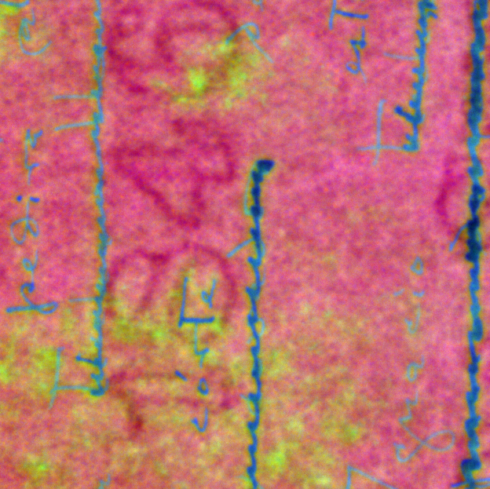
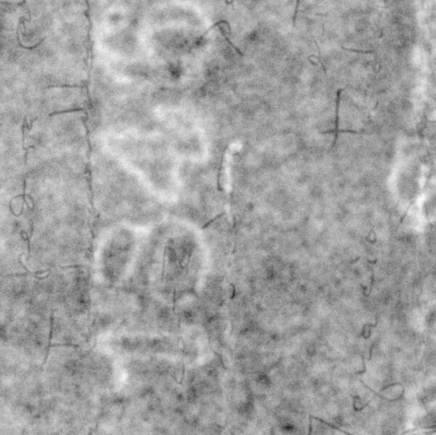

# Week 9 - The Importance of Pre-processing 

## Overview
I spent Week 9 adding two new steps to our processing pipeline: dark current correction and reflectance calibration. We'll discuss the results of applying these new pre-processing steps to our dataset.

## Experiments

### Pre-processing tools: Dark Current Correction and Reflectance Calibration

Dark Current Correction is a pre-processing technique used to reduce the intrinsic noise of a sensor. In the context of MSI, where our sensors are multispectral cameras, the noise is captured as an image. We can then subtract this noise from our dataset. While this step does not fully remove intrinsic noise, it can greatly reduce it.

Reflectance Calibration is another pre-processing tool. By using a reference patch in the captured data (in our case, the inside of a spectralon), we can safely normalize the channels, a process that will affect the results of PCA and ICA.

In our reference paper, both steps were used in the same order as pre-processing steps. We will add these steps to pre-processing and examine how they change the results.

In this experiment, our main goal is to test if dark current correction and reflectance calibration can actually improve the visibility and separation of the undertext from the overtext.

Just like in last week's experiment, we'll experiment on the following patch of one of the images in our dataset:

In the following image comparisons, the first image will show the result of the pipeline without the new processing steps and the second image show the result with the two new steps.

By reducing the number of channels from 16 to 3 through PCA, we get the following false-color image:

If we instead reduce the number of channels from 16 to 12 (still through PCA) and then apply ICA to extract 3 components, we get components for text, texture and noise. The texture component follows:

While the new steps did not meaningly affect the RGB recomposition, the text component or the noise component, they did not make any of these images worse to read. In the case of the texture component, especifically, the results are much more promising: in the very center of the image, some parts of the undertext can now be seen. 

Even though the undertext can not still be confortably read, the results of this experiment show these new pre-processing steps can be crucial the success of the pipeline.

## Next Steps

We've implemented and tested the core pipeline of the model paper. Therefore, in the following weeks, we'll explore new papers. 

---

*Research supported by FAPESP.*